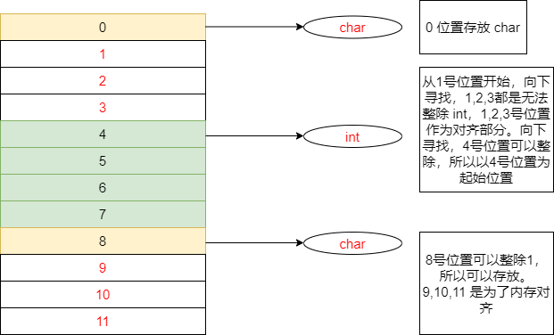
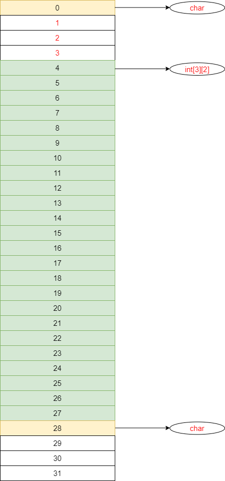

# c 语言笔记

---

<strong>一切皆地址。</strong>

## c 程序在 Linux32 操作系统上内存分配

个人认为学习掌握 C 语言的内存管理机制，是学好 C 语言的重点，很多问题可以迎刃而解。

下面我们以 C 语言程序在 Linux32 系统的内存模型为例：
Linux 32 系统的内存地址是从 `0x00000000 ~ 0xffffffff`，其中 `0x00000000 ~ 0xc0000000`是用户空间的地址（0 ~ 3G）， `0xc0000000 ~ 0xffffffff`是内核空间（3G ~ 4G）。


| 内存分区                   | 说明                                                                                                                                                         |
| -------------------------- | ------------------------------------------------------------------------------------------------------------------------------------------------------------ |
| 程序代码区                 | 存放二进制代码。                                                                                                                                             |
| 常量区                     | 存放一般的常量（const 修饰）、字符串常量。这块内存只有读取权限，在程序运行期间它们的值不能改变。                                                             |
| 全局数据区                 | 存放全局变量（定义在函数外部的变量，可被当前文件全局访问或其它文件访问）、静态变量 （static 修饰）。这块内存有读写权限，在程序运行期间它们的值可以任意改变。 |
| 堆区                       | 一般是交给开发者分配和释放的。（如果开发者不释放，程序运行结束时，由操作系统回收）`malloc`，`free`等函数就是操作这块内存的。                                 |
| 动态链接库/mmap 内存共享区 | 用于在程序运行期间加载和卸载动态链接库；mmap 共享内存区域                                                                                                    |
| 栈区                       | 存放函数的参数值，局部变量的值等。                                                                                                                           |

```
查看进程
    ps
查看进程的内存分配
    cat /proc/{进程id}/maps
```

## 存储类

- <strong>auto</strong> 是函数或变量默认的修饰符
- <strong>static</strong> 可以修饰变量或函数
- <strong>extern</strong> 可以修饰全局变量或函数。不会为变量分配存储空间，只是指示编译器该变量或者函数在其它文件中定义
- <strong>register</strong> 可以修饰存储在寄存器中而不是内存中的局部变量。 这个不常用

## const 修饰符

- const 修饰的变量，存放在常量区 eg: `const int a = 2;`
- 常量字符串，也是存放在常量区的
  

## 数据类型

### 基本数据类型

基本数据类型有一下几种：

- char
- short
- int
- long
  可以用 signed unsigned 来修饰决定取值范围； 默认的 char short int long 的取值范围不确定，由操作系统决定

| 基本数据类型   | 存储字节数  | 取值范围                                             |
| -------------- | ----------- | ---------------------------------------------------- |
| char           | 1 字节      | -128 到 127 或 0 到 255                              |
| unsigned char  | 1 字节      | 0 到 255                                             |
| signed char    | 1 字节      | -128 到 127                                          |
| int            | 2 或 4 字节 | -32,768 到 32,767 或 -2,147,483,648 到 2,147,483,647 |
| unsigned int   | 2 或 4 字节 | 0 到 65,535 或 0 到 4,294,967,295                    |
| short          | 2 字节      | -32,768 到 32,767                                    |
| unsigned short | 2 字节      | 0 到 65,535                                          |
| long           | 4 字节      | -2,147,483,648 到 2,147,483,647                      |
| unsigned long  | 4 字节      | 0 到 4,294,967,295                                   |

浮点型

- float
- double

<strong>这些基本数据类型占用的字节数由操作系统决定。</strong>
查看数据类型占用的字节数可以用 `sizeof` 查看，示例如下：

    #include <stdio.h>
    int main() {
        // 查看 int 占用多少个字节
        printf("%lu\n", sizeof(int));
        return 0;
    }

### 其它类型

#### void 类型

可用作：

- 函数的返回值
- 函数参数
- 指针指向 void

#### enum 枚举

    enum 枚举名 {
        枚举元素1，
        枚举元素2，
        枚举元素3，...
    };

#### struct 结构体

<p style="color:red;">个人感觉：有点像面向对象语言中的类</p>

    struct 结构体名字 {
        成员1;
        成员2;
        成员3;
        ...
    };

<strong>
结构成员的值尽量按照占用字节大小顺序从小到大排列；因为涉及到内存对齐
</strong>

##### 什么是内存对齐？

将一个数据尽量控制在一个步长之内，避免跨步长存储，这种就称作步长对齐。

##### 为什么要内存对齐？

因为 CPU 寻址采用了步长寻址。

这里我们以 4 位一个步长来解释：

一个变量最好是位于一个步长的范围内，这样一次就可以读取到变量的值；如果跨步长存储，就需要读取两次甚至多次，然后做数据拼接，这样效率就大大降低了。

##### 下面分析一下 struct 的占用的内存

- 成员是否能被地址整除，如果可以整除，则该位置为起始位置，否则继续向下寻找，能整除的地址
- 结构体以占用内存最大的成员对齐（如果有嵌套结构体，则以嵌套结构体占用内存最大的成员对齐）
- 如果数组，则以它的元素计算内存（看地址是否能整除数组元素的内存）

```
struct A {
    char a;
    int b;
    char c;
};
```



```
struct B {
    char a;
    int b[3][2];
    char c;
}
```



#### union 共用体

    union 共用体名称 {
        成员1;
        成员2;
    };

- 共用体是一种特殊的数据类型，允许在相同的内存地址存储不同的数据类型。
- 共用体占用的内存空间 = 占用内存最大的成员的内存空间。也就是说：如果给共用体所有的成员都赋值的话，会出现值覆盖的现象。所以在用共用体时，需要注意这种情况。

## 数组

    类型 名称[数组大小] = {...}；

### 一维数组

```
char *a = "abcd";   //  "abcd" 是一个字符串常量，无法修改值，默认包含 '\0'结束符 ； 指针a指向该字符串常量
char b[5] = "abcd"; // 数组大小5；包含了 'a', 'b', 'c', 'd', '\0'；其中 '\0' （字符串结束符）是默认包含的，在声明数组的大小时需要考虑这个元素。
char b[] = "abcd";  // 默认包含 '\0'结束符
char d[5] = {'a', 'b', 'c', 'd'}; // 可以不写默认项 '\0';
char e[] = {'a', 'b', 'c', 'd', '\0'}; // 必须写 '\0'; 否则数组不知道自己的长度是多少。
```

#### 访问数组元素

```
char a[5] = "abcd";
```

<strong>在访问二维数组元素之前，先要弄明白:</strong>

- `a` 指向数组`a`首地址，步长为 char； `a + 1`，指向数组`a`的 1 号位值
- `a[0]` 取数组`a`0 号位置的元素的值
- `&a` 指向数组`a`首地址，步长为 5 个 char，`&a + 1`，向后移动 5 个字节，移动到别人的位置上去了。

##### 数组下标的方式

```
for (int i = 0; i < sizeof(a); i++) {
    printf("%c\t", a[i]);
}
```

##### 指针移位的方式

<strong>数组名默认是指向首元素存放的地址</strong>

```
for (int i = 0; i < sizeof(a); i++) {
    printf("%c\t", *(a + i));
}
```

### 二维数组

```
// 4 行 2 列 的 int 数组
int a[4][2] = {1,2,3,4,5,6,7,8};
```

<strong>在访问二维数组元素之前，先要弄明白:</strong>
`int a[4][2] = {1, 2, 3, 4, 5, 6, 7, 8};` 等价于 `int a[4][2] = {{1, 2}, {3, 4}, {5, 6}, {7, 8}};`
数组 a 的 4 个元素都是 int[2]的数组。

- `a`是什么？ `a`指向数组`a`的首元素，也就是`{1,2}`；`a + 1`指向`{3,4}`
- `a[0]`是什么？ `a[0]`就代表`a[0] = {1,2}`; `a[0]`指向值为 1 这个元素的地址; `a[0]+1`，指向值为 2 这个元素的地址
- `a[0][0]`是什么？`a[0][0]` 就是取值，值为 1
- `*a`是什么？ `a`指向数组`a`的首元素，那么可以当做指针理解，`*a`就是首个元素地址上存放的值，首个元素地址上存放的值是数组`{1,2}`的首首地址。<strong>所以`*a`等价于`a[0]`</strong>
- `&a`是什么？ `&a`指向数组`a`的首地址； `a + 1`则是以数组`a`所有元素为步长向后移位

#### 访问二维数组元素

##### 数组下标的方式

```
for (int i = 0; i < 4; i ++) {
    for(int j = 0; j < 2; j ++) {
        printf("\t%d\t", a[i][j]);
    }
    printf("\n");
}
```

##### 指针移位的方式

###### 访问每一个元素

```
for (i = 0; i < 8; i ++) {
    printf("\t%d\t", *(*a + i));
}
```

###### 访问每行的首元素

```
for (i = 0; i < 4; i ++) {
    printf("\t%d\t", **(a + i));
}
```

## 指针

<strong>指针就是用来存放地址的</strong>
指针变量本身自己也是有地址的，只不过它的值存放的是别人的地址

### 指针运算

指针运算都是以步长为单位进行运算的。

- `int *p` 步长为一个 int 占用的字节
- `char *p` 步长为一个 char 占用的字节

```
int arr[4] = {1,2,3};
int *p = arr;
p++; // 指向元素2的地址
p--; // 指向元素1的地址
```

### 指针数组和数组指针

- 指针数组：重点在于数组，是一个指针类型的数组，数组的每个元素都是指针。<strong>强调一点：指针自己有地址，值是存放别人的地址</strong><strong>定义`int *p[n]`</strong> 。<strong>它的步长是指针类型占用内存的大小；数组每个元素有对应的地址，`p + 1`是指向下一个数组元素的地址，数组元素的地址上存放的值是指针地址</strong>
- 数组指针：重点在于指针，它指向的是一个数组。<strong>定义`int (*p)[n]`</strong>。其实是可以理解为`typedef int name[n]; name *p;`。<strong>它的步长是`int[n]`即`sizeof(int) * n`；每个元素就是一个数组</strong>

## 字符串
## 函数