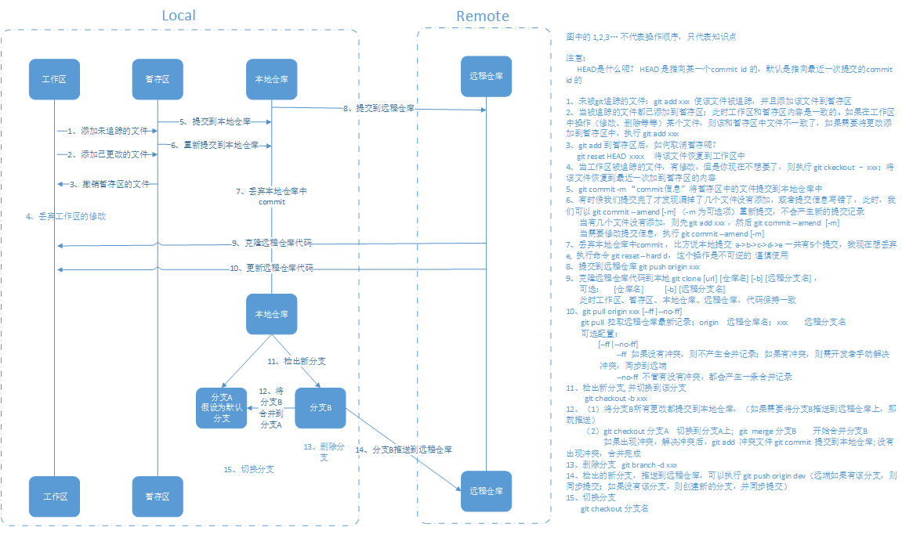
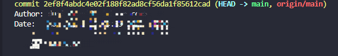
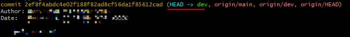

## <span id="git">git</span>



这里只列出基本的命令，那些简洁的但是在特定场景下使用的命令，可以自行去 [git 官网](https://git-scm.com/book/zh/v2) 查看

```
小知识：
origin 就是给远端仓库起了一个名称而已，这个是可以更改的，这个更改并没有什么影响，只是本地这边对远端仓库起了一个名字而已
git remote rename origin ori  将远端仓库的名称从 origin 改成 ori

在没有改之前：提交代码是这样的  git push origin master
改了之后：提交代码是这样的  git push ori master
```

-   [git config](#git_config)
-   [git init](#git_init)
-   [git remote](#git_remote)
-   [git clone](#git_clone)
-   [git add](#git_add)
-   [git commit](#git_commit)
-   [git reset](#git_reset)
-   [git branch](#git_branch)
-   [git checkout](#git_checkout)
-   [git merge](#git_merge)
-   [git pull](#git_pull)
-   [git push](#git_push)
-   [git stash](#git_stash)
-   [git log](#git_log)
-   [git status](#git_status)

#### <span id="git_config">git config</span>

###### git config 配置

```
配置git，比如：用户名，邮箱，编辑器，等等

git config [--global|--local] [配置项名称] "配置项名称"

必须：
[配置项名称] "配置项名称"    eg: user.name "填你自己名称"

可选：
[--global|--local]
                        --global 指代全局配置
                        --local  指代配置当前git仓库  --local 可以省略

注意：
[配置项名称] "配置项名称"   必须同时配置
全局配置某个属性：无论当前文件夹是不是git仓库都可以配置生效
局部配置某个属性：必须在某个指定git仓库下，才可以配置生效

举例：
1、全局配置用户名:
git config --global user.name "xxx"

2、局部配置用户名，必须进入到某个指定的git仓库中：
git config --local user.name "xxx"
git config user.name "xxx"
```

###### git config 取消配置

```
git config [--global|--local] --unset [配置项名称]

取消全局配置则：
git config --global --unset [配置项名称]

取消当前git仓库配置
git config [--local] --unset [配置项名称]
[--local] 可以省略

举例：
1、取消全局配置的用户名:
git config --global --unset user.name

2、取消局部配置的用户名，必须进入到某个指定的git仓库中：
git config --local --unset user.name
git config --unset user.name
```

###### git config 显示配置信息

```
git config [--global|--local] --list

显示全局配置信息：
git config --global --list

显示局部配置信息：
git config --global --list

显示全部配置信息：
git config --list    // 如果当前目录不是git仓库，则显示全局配置信息

显示单个配置信息：
git config [--global|--local][配置项名称]  --local 是查询当前目录下配置，可以省略
举例:
查看当前目录的配置   git config user.name
查看全局的配置      git config --global user.name
```

#### <span id="git_init">git init</span>

```
将现有的代码库初始化为 git 仓库

git init
当前文件目录下会出现 .git 文件夹

注意：
当前文件虽然为 git 仓库，还需要做以下操作：
    新建 .gitignore 文件，配置忽略文件（不被 git 追踪的文件）
    添加要追踪的文件(git add .)
    添加远端仓库(后续会讲到)
```

#### <span id="git_remote">git remote</span>

```
用途：
1、查看远端仓库信息
    git remote [-v|--verbose]
2、增加远端仓库地址
    git remote add origin [git 地址]
3、删除远端仓库地址
    git remote remove origin
4、给远端仓库重命名
    git remote rename [old name] [new name]
        eg: git remote rename origin new_origin      就是将远程仓库的名称改成了 new_origin
```

#### <span id="git_clone">git clone</span>

```
git clone [git地址] [仓库名] [-b] <远端分支名>

必须：
[git地址]  远端仓库的地址

可选：
[仓库名]   配置可选项 [仓库名] 后，本地检出的文件夹名为配置的仓库名；否则为远端默认的仓库名
[-b] <远端分支名>  配置可选项[-b] <远端分支名>后，本地将检出该 <远端分支名> 的代码，并且 HEAD 指向 <远端分支名>

注意：
[-b] <远端分支名> 两个必须同时配置
```

##### 默认

```
git clone [git地址]

举例:
git clone git@github.com:DuSourceCode/NoteCode.git

本地会出现 NoteCode
```



##### clone 配置仓库名

```
git clone [git地址] [仓库名]
仓库名为可选配置： 如果不配置，则为远端仓库的名称即为 NoteCode

举例:
git clone git@github.com:DuSourceCode/NoteCode.git  MyRep

clone 后文件夹的名称为 MyRep
```

##### git clone clone 指定远端分支

```
git clone [git地址] [仓库名] ([-b] <远端分支名>)

举例：
git clone git@github.com:DuSourceCode/NoteCode.git -b dev
```



#### <span id="git_add">git add</span>

```
git add [文件的通配符|具体文件]

git add . 当前目录下所有的文件
git add *.c 通配当前目录下的所有以.c结尾的文件
git add index.html 具体的文件 如果是多个文件，以空格分开就行 git add a.c b.c c.c
```

#### <span id="git_commit">git commit</span>

```
将暂存区的文件提交到本地仓库中

git commit [-m "你的描述信息"]
可选项：
    [-m "你的描述信息"]

举例：
    git commit -m "对你这次提交的描述信息"
    git commit 按回车键，则会弹出一个文本编辑器，供你输入你的提交描述信息

你刚刚 commit 完毕，在还没有往远端推之前，你发现你有：
    漏提交的（将 漏提交的文件 git add xxx）；
    或者 commit 信息填的不准备；
    执行 git commit --amend  该提交不会产生新的提交记录，
```

#### <span id="git_reset">git reset</span>

```
其中我这里有两个用途：
1、将暂存区中文件恢复到工作区中
    git reset HEAD [文件名]
    举例：
        git reset HEAD a.txt  则该文件所有未提交到本地仓库中内容都恢复到工作区中

2、丢弃本地仓库中的commit
    git reset --hard [commitid]
    举例：
        如果有本地仓库中有 a->b->c 三个提交，如果我想要丢弃掉c，那么可以执行
        git reset --hard b
```

#### <span id="git_branch">git branch</span>

```
用途：
1、查看分支
    （1）查看本地分支   git branch
    （2）查看远端分支   git branch [-r|--remotes|--remote]
    （3）查看所有远端和本地分支 git branch [-a|--all]
2、删除本地分支分支
    git branch [--delete|-d] [分支名]
3、更改分支名
    git branch [-M] [new分支名]
```

#### <span id="git_checkout">git checkout</span>

```
用途：
1、切换分支或指向某个commit-id
    git checkout [分支名|commit-id]    其中指向最近一次提交的commit-id 简单命令  git checkout --detach
2、创建新的分支，并切换到该分支
    git checkout -b [new分支名]
3、丢弃工作区的修改
    git reset HEAD [文件名] （本质上是：将该文件内容恢复到最近一次加到暂存区的内容）
```

#### <span id="git_merge">git merge</span>

```
用途：
合并分支
    git merge [分支名]
    如果常出现冲突：
    （1）手动解决冲突；
    （2）执行 git add [xxx]；
    （3）git merge --continue 继续合并，也可以使用 git commit [-m]

小知识：
    如果想取消合并，则执行 git merge --abort
```

#### <span id="git_pull">git pull</span>

```
用途：
同步远端仓库代码
    git pull [origin] [分支名] [--ff|--no-ff]
    可选配置：
        [--ff|--no-ff]
            --ff 如果没有冲突，则不产生合并记录，如果有冲突，则需要开发者手动解决冲突，并将代码推送到远端
            --no-ff 不管有没有冲突，都会产生一条合并记录

本质：
    git pull origin [分支名]  =  git fetch origin [分支名] + git merge [origin/分支名]
    git fetch 会在 .git 文件夹中生成 FETCH_HEAD (内容是记录 remote 最近的 commit-id)
    git merge 是将 local 最新的提交和 remote 最新的提交 合并，其它的 remote commit 按照时间顺序合并在 local 中
```

#### <span id="git_push">git push</span>

```
用途：
向远端推送代码
    git push origin [分支名]
```

#### <span id="git_stash">git stash</span>

```
用途：
如果工作区或暂存区中有修改，不想提交，又想拉取远端的代码
    git stash       将代码存储到栈中
    git pull        拉取远端代码
    git stash pop   将代码从栈中恢复到工作区中

git stash list              查看所有存储到栈中的东西
git stash apply stash{0}    应用栈中的某个存储
```

#### <span id="git_log">git log</span>

```
用途：
    查看提交记录
    git log --graph 在日志旁以 ASCII 图形显示分支与合并历史

小技巧：
    在 config 中配置别名 git config --global alias.logtree 'log --graph'
    使用 git logtree 就可以看到图形显示分支与合并冲突
```

#### <span id="git_status">git status</span>

```
用途：
    查看当前工作树状态
    git status 查看整个git目录下的工作树状态
    git status ./ 当前目录下的工作树状态
```
